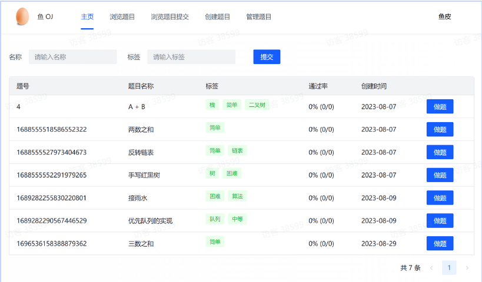
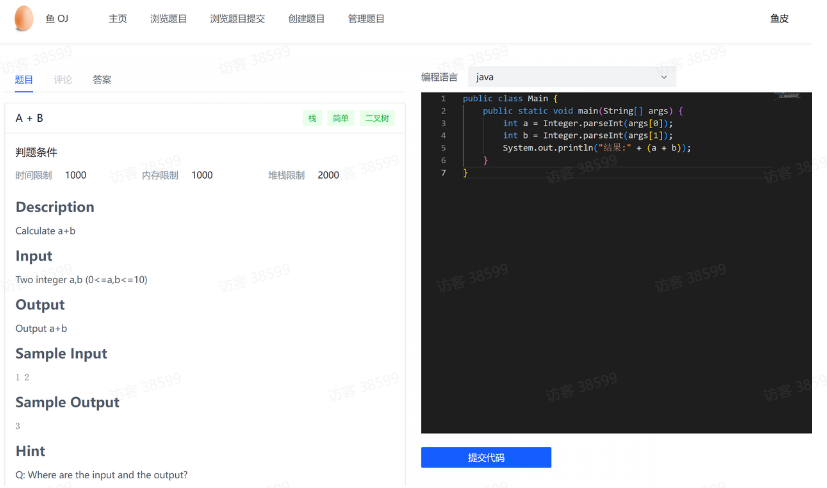

# CodeMap算法学习平台

## 项目概述
本项目是一个基于SpringBoot、MyBatis-Plus、SpringCloud、RabbitMq以及Docker技术构建的在线编程题目评测平台，旨在支持创建和提交编程题目。系统提供了强大的管理功能，允许管理员创建和编辑题目标题、描述、样例输入输出及时间和空间限制条件。用户可以提交代码并查看自己和其他用户的提交记录。

**分布式版本**   [https://github.com/study-till-night/oj-backend-cloud](https://github.com/study-till-night/oj-backend-cloud)



## 技术栈
- 后端框架：Spring Boot
- ORM 框架：MyBatis-Plus
- 云基础设施：Spring Cloud
- 消息队列：RabbitMq
- 代码沙箱实现：Docker、Java Runtime

## 关键特性
- **题目管理**：管理员能够创建和管理题目内容，包括题目名称、描述、样例输入输出以及资源需求限定。
- **代码提交与查阅**：用户可以提交自己的代码并访问自身及其他用户的提交历史记录。支持条件查询。
- **判题服务** 用户提交代码后程序异步执行代码沙箱，得到执行结果后利用动态工厂 + 策略模式进行判题逻辑
- **独立代码沙箱服务**  见下文

## 代码执行沙箱
代码沙箱仓库地址 [codeSandBox](https://github.com/study-till-night/oj-sandbox)

### 原生Java实现
使用了原生Java实现了一个代码沙箱，通过`Java Runtime`对象的`exec`方法执行如`javac -encoding utf-8 ${path}`这样的命令来编译和运行Java程序，通过`Process`类的输入流获取执行结果，从而实现对Java代码的安全运行评估。

   _异常处理与安全措施_：
   - 超时中断：采用守护线程结合`Thread.sleep()`等待机制实现对超出执行时限进程的中断。
   - 安全防护：运用黑名单和字典树方式对Java `File`类涉及文件读写等敏感操作进行校验和限制。
   
####  具体流程
1、将用户代码保存为临时.java文件

2、使用Runtime的exec方法对.java文件进行编译得到.class字节码文件 判断exitCode==0？

3、使用Runtime的exec方法执行.class文件    并使用Process类的输入流向程序输入测试用例

4、使用Process类的输出流得到程序执行结果    对所有输出结果进行收集

5、清除临时生成的.java和.class文件

### Docker容器化实现

另外还提供了一种基于Docker的更为安全的代码沙箱方案。通过使用```Docker-Java```库拉取JDK镜像并动态创建容器来隔离执行代码。

   _执行隔离_：
   - 容器卷映射：将本地编译后的用户代码与容器内部路径进行绑定映射，确保代码在容器内部执行。
   - 测试用例输入：通过tty将测试用例传入容器中以便执行。

   _Docker沙箱中的资源限制与异常处理_：
   - 资源限制：为了防止资源过度消耗，在```HostConfig```中设置了容器运行时分配的内存限制，并进行了网络隔离。
   - 执行超时控制：为每个容器执行任务设置了超时参数，以防止无限循环或长时间运行的情况。

####  具体流程
1、将用户代码保存为临时.java文件

2、使用Runtime的exec方法对.java文件进行编译得到.class字节码文件 判断exitCode==0？

3、拉取jdk17镜像，对于每个提交动态创建一个容器，利用tty与容器进行交互，输入测试用例得到输出，输出完成后删除容器（后续可以优化对容器进行复用）

4、利用回调对象的监控方法    对所有输出结果进行收集

5、清除临时生成的.java和.class文件

## 核心业务逻辑
### 代码提交执行流程

1、请求QuestionController的doSubmit接口

2、执行QuestionSubmitServiceImpl的doSubmit方法，保存记录并异步调用judgeService的doJudge方法，传入提交ID

---

**代理模式**

沙箱顶层接口CodeSandBox   包含唯一方法executeCode 接收ExecuteCodeRequest对象

```java
public class ExecuteCodeRequest {

    private List<String> inputs;

    private String language;

    private String code;
}
```

代理类CodeSandBoxProxy实现CodeSandBox 并在实现类的基础上在方法执行前后添加增强内容，比如日志打印

```java
public ExecuteCodeResponse executeCode(ExecuteCodeRequest request) {
        log.info("代码沙箱请求信息--{}", request.toString());
        ExecuteCodeResponse executeCodeResponse = codeSandBox.executeCode(request);
        log.info("代码沙箱响应信息--{}", executeCodeResponse.toString());
        return executeCodeResponse;
    }
```

---

3、在doJudge方法中执行sandBoxProxy的executeCode方法

4、根据application.yml文件中配置的代码沙箱模式，调用相应的代码沙箱服务

```yml
#自定义代码沙箱类型
codesandbox:
  #  共三种 ExampleSandBox  remoteSandBox ThirdPartySandBoxImpl
  type: remoteSandBox 
```

5、以远程型为例，通过Rpc远程调用请求代码沙箱的开放API得到ExecuteCodeResponse

```java
public class ExecuteCodeResponse {

    private List<String> outputList;

    /**
     * 接口信息
     */
    private String message;

    /**
     * 执行状态
     */
    private Integer status;

    /**
     * 判题信息
     */
    private JudgeInfo judgeInfo;
}
```


```java
public ExecuteCodeResponse executeCode(ExecuteCodeRequest request) {
    ThrowUtils.throwIf(request == null, ErrorCode.PARAMS_ERROR);

    // 调用远程沙箱的post请求
    String response = HttpUtil.createPost(POST_URL)
            .header(AUTH_HEADER,AUTH_KEY).body(JSONUtil.toJsonStr(request)).execute().body();
    ThrowUtils.throwIf(StringUtils.isBlank(response), ErrorCode.SYSTEM_ERROR, "代码沙箱服务调用失败");

    return JSONUtil.toBean(response, ExecuteCodeResponse.class);
}
```

---

**动态工厂模式**

通过java反射机制根据传入的字符串查询枚举类，动态地生成实现类

```java
public class JudgeServiceFactory {

    public static JudgeStrategy getJudgeStrategy(String type) {
        if (StringUtils.isBlank(type))
            return new DefaultJudgeStrategy();

        // 通过反射得到策略实现类的实例
        try {
            return (JudgeStrategy) Class.forName(JudgeStrategyEnum.getByValue(type).getClassName()).getDeclaredConstructor().newInstance();
        } catch (ClassNotFoundException | InvocationTargetException | InstantiationException | IllegalAccessException |
                 NoSuchMethodException e) {
            throw new RuntimeException(e);
        }
    }
}
```
---
**策略模式**

根据不同情景 判题服务可有多种策略   设置一个JudgeManager 根据传入的context上下文
```java
public class JudgeContext {

    private JudgeInfo judgeInfo;

    private List<String> inputList;

    private List<String> outputList;

    private List<JudgeCase> judgeCaseList;

    private Question question;

    private QuestionSubmit questionSubmit;
}
```
调用动态工厂生成相应策略实现类

```java
JudgeInfo doJudge(JudgeContext judgeContext) {
        QuestionSubmit questionSubmit = judgeContext.getQuestionSubmit();
        String language = questionSubmit.getLanguage();
        // 利用工厂反射得到实例
        JudgeStrategy judgeStrategy = JudgeServiceFactory.getJudgeStrategy(language);

        return judgeStrategy.doJudge(judgeContext);
}
```
---

6、根据得到的ExecuteCodeResponse，执行JudgeManager的doJudge方法，判断执行结果是否与预期一致 并判断时空间是否满足要求 根据此置提交结果为AC TLE或MLE等

7、前端查询新结果进行展示


## 未来改进方向
- 不断优化和完善两种代码执行沙箱的安全性和性能表现。
- 丰富平台功能，如支持在线竞赛（实时排名、滚榜）
- 在`/docs`文件夹下提供详尽的系统设置和使用文档（如果尚未提供，请创建）。

---
